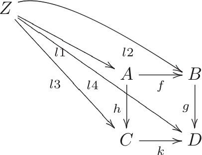

# RDCategoryWriter
It is a program to transform Diagram used in Categorical Theory to LaTex (xymatrix) using Swift.

```swift
func sample() {
     let z = CObject("Z")

    let a = CObject("A")
    let b = CObject("B")
    let c = CObject("C")
    let d = CObject("D")
    
    z.addDownRight(a,dx:1)

    a.addRight(b).setArrow("f").addDown(d).setArrow("g")
    a.addDown(c).setArrow("h").addRight(d).setArrow("k")
    
    z.to(a).setArrow("l1")
    z.to(b).setArrow("l2",attr:"@(ur,dr)")
    z.to(c).setArrow("l3")
    z.to(d).setArrow("l4")
    
    let cat = Category(objects:[z,a,b,c,d])
    let mat = matrix(cat)
    display(matrix:mat.matrix, matrixsize:mat.maxsize, arrows:mat.arrows)
}


```

# Output
```latex
\xymatrix{
Z \ar[rrd]_{l1}^{} \ar@(ur,dr)[rrrd]_{l2}^{} \ar[rrdd]_{l3}^{} \ar[rrrdd]_{l4}^{}  &    &    &    \\
   &    & A \ar[r]_{f}^{} \ar[d]_{h}^{}  & B \ar[d]_{g}^{}  \\
   &    & C \ar[r]_{k}^{}  & D
}
```

